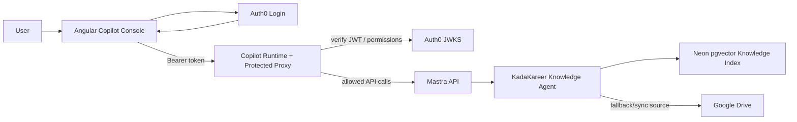
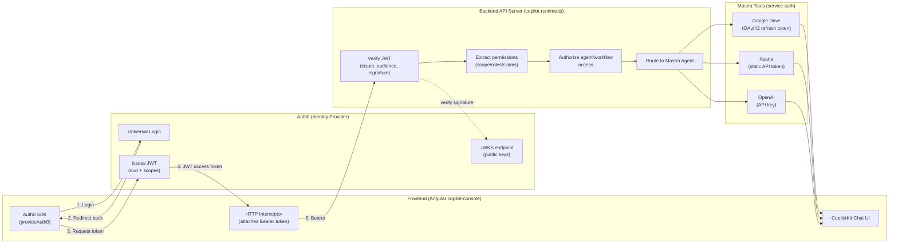
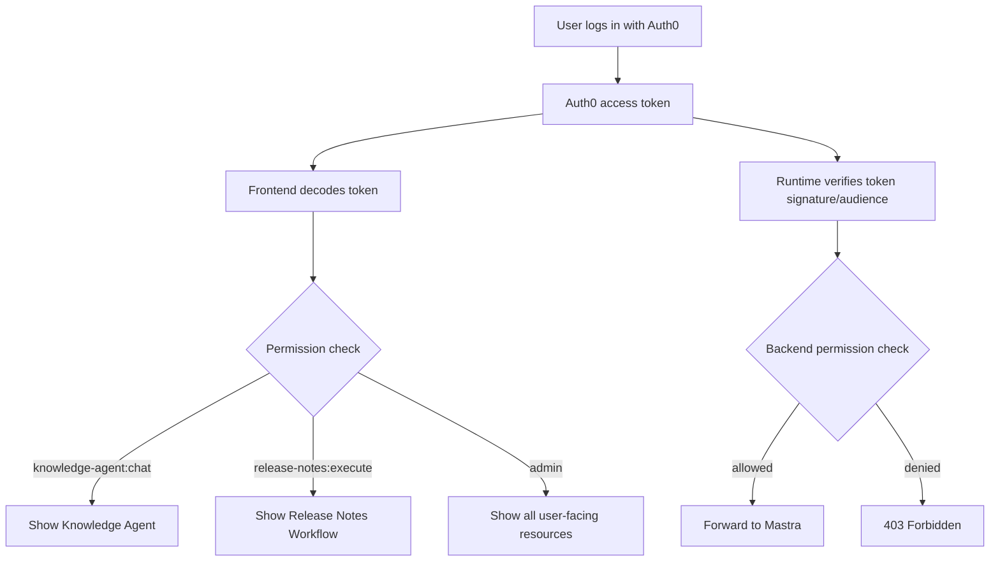
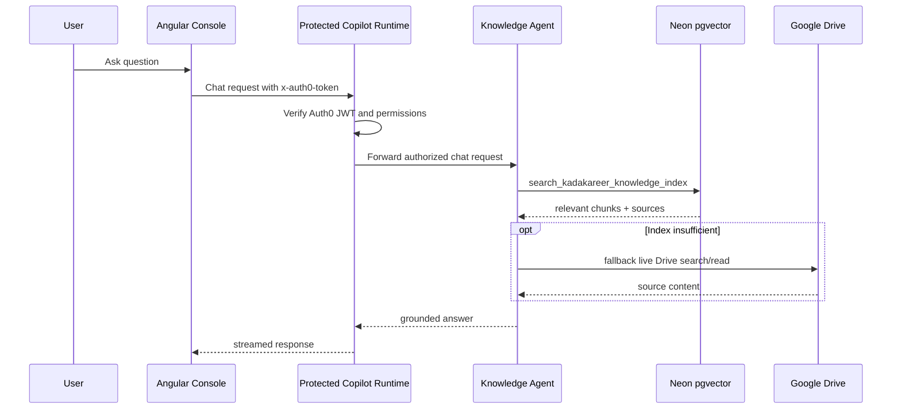

# Flowcharts

Diagrams for the KadaKareer Copilot Console. See [frontend.md](./frontend.md), [backend.md](./backend.md), [authentication.md](./authentication.md), and [ai-architecture.md](./ai-architecture.md) for the accompanying explanations.

## High-Level Flow

## Authentication Overview (FE / BE / Tools)

## RBAC Flow

## Knowledge Query Flow

